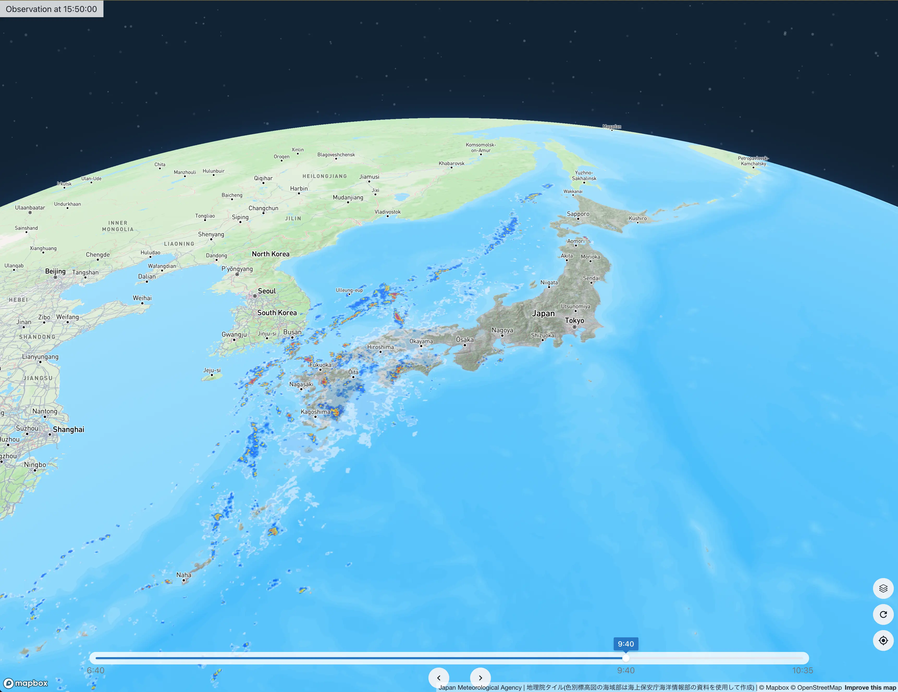

# radar-map-v2
This application provides a dynamic overlay of real-time raincloud radar information onto a map, offering users an immersive view of current weather patterns.  Leveraging the capabilities of Mapbox GL JS v3, it provides a detailed map representation including 3D buildings and terrain. It also integrates tiles from the Geospatial Information Authority of Japan, providing a comprehensive geographical perspective.

